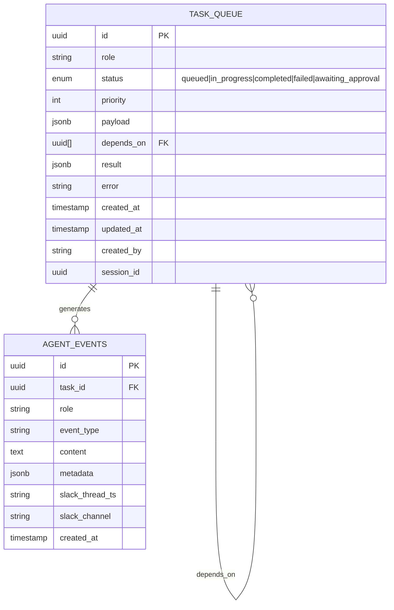
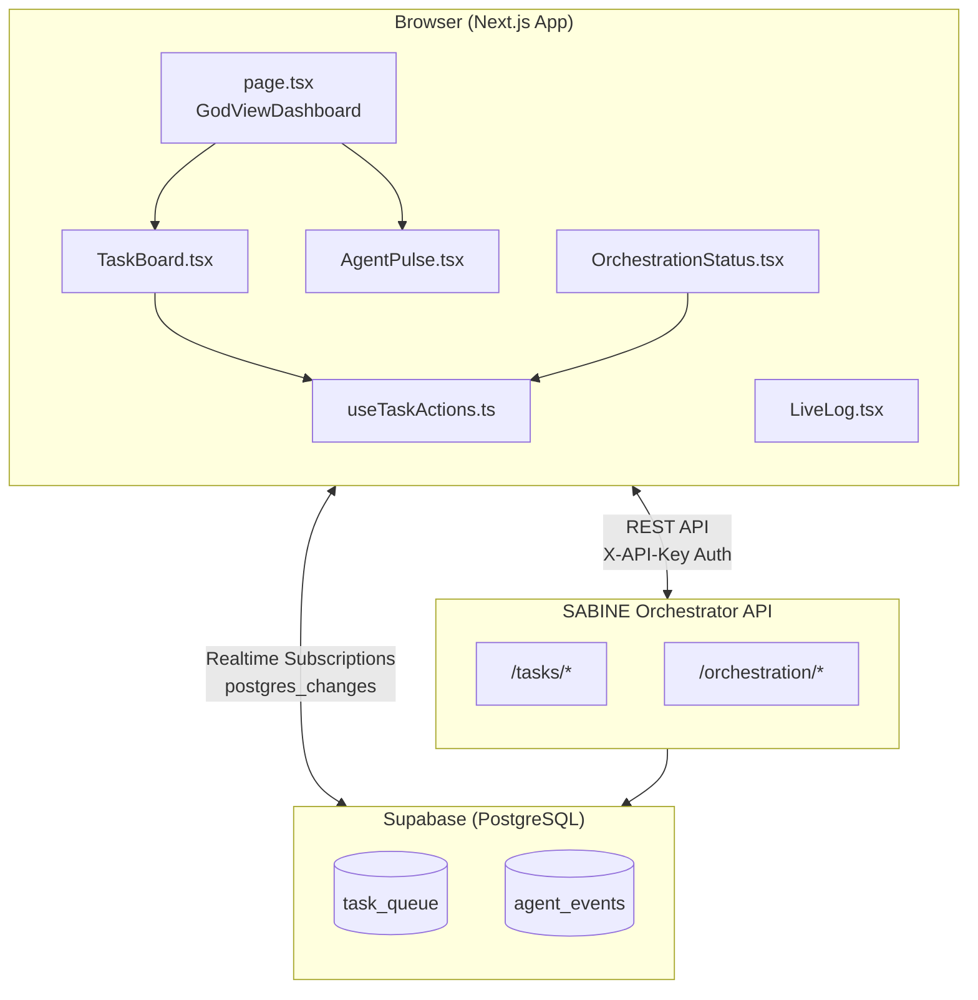
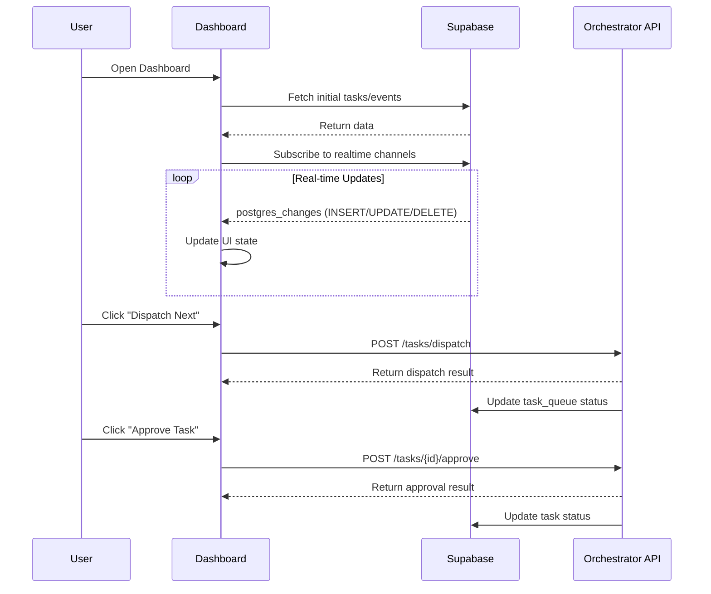
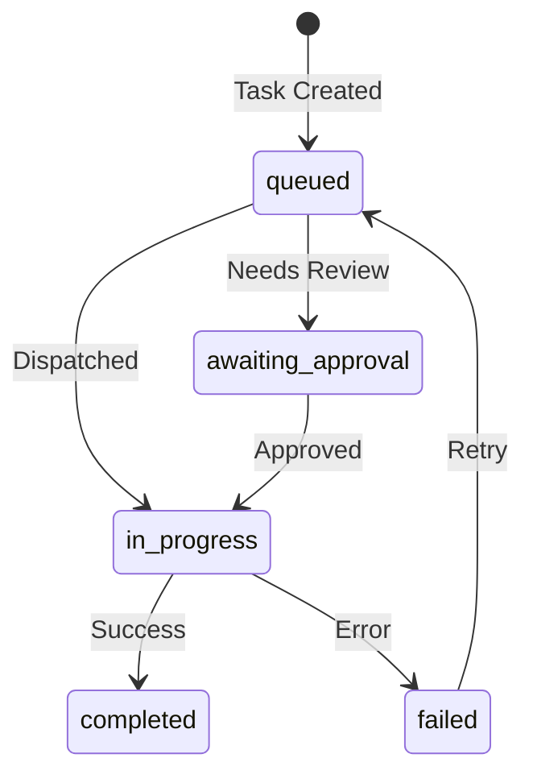

# Project Atlas - Architectural Documentation

> **Generated:** 2026-02-01 | **Version:** 2.0.0 | **Status:** Compiled

---

## Executive Summary

**Project Dream Team** is a **God View Dashboard** for the SABINE (Super Agent) orchestration system, built for Strug City Engineering. It provides real-time visibility into multi-agent task execution, event streaming, and workflow management.

### Technology Stack

| Layer | Technology | Version |
|-------|------------|---------|
| **Framework** | Next.js | 14.2.21 |
| **Language** | TypeScript | 5.3.x |
| **UI Library** | React | 18.2.x |
| **Database** | Supabase (PostgreSQL) | SDK 2.39.x |
| **Styling** | Tailwind CSS | 3.4.x |
| **Animation** | Framer Motion | 11.18.x |
| **Icons** | Lucide React | 0.469.x |

### Architecture Pattern

- **Client-Side Rendering** with `'use client'` directives
- **Real-Time Subscriptions** via Supabase Postgres Changes
- **External API Integration** for task orchestration (FastAPI backend at `localhost:8000`)
- **Component-Based Architecture** with custom hooks for state management

---

## Visual Data Map

### Entity Relationship Diagram

### System Component Diagram

### Data Flow Diagram

---

## Governance Matrix

### Source Directory to Component Mapping

| Source Path | Component | Responsibility | External Dependencies |
|-------------|-----------|----------------|----------------------|
| `src/app/page.tsx` | GodViewDashboard | Main dashboard view with events/tasks tabs | Supabase Client, AgentPulse |
| `src/app/layout.tsx` | RootLayout | App shell and metadata | Next.js |
| `src/components/TaskBoard.tsx` | TaskBoard | Kanban-style task queue visualization | Supabase, useTaskActions, Framer Motion |
| `src/components/LiveLog.tsx` | LiveLog | Real-time event stream display | Supabase, Framer Motion |
| `src/components/AgentPulse.tsx` | AgentPulse | Header badge showing latest activity | Supabase, Framer Motion |
| `src/components/OrchestrationStatus.tsx` | OrchestrationStatus | Task statistics dashboard | useTaskActions |
| `src/hooks/useTaskActions.ts` | useTaskActions | API hook for task CRUD operations | External Orchestrator API |
| `src/lib/supabase.ts` | Supabase Config | Client initialization and type definitions | @supabase/supabase-js |
| `src/lib/utils.ts` | Utilities | Helper functions (cn, clsx) | clsx, tailwind-merge |

### Test Coverage Matrix

| Source Directory | Test Directory | Coverage Status |
|------------------|----------------|-----------------|
| `src/app/` | `tests/app/` | **NOT FOUND** - No test directory exists |
| `src/components/` | `tests/components/` | **NOT FOUND** - No test directory exists |
| `src/hooks/` | `tests/hooks/` | **NOT FOUND** - No test directory exists |
| `src/lib/` | `tests/lib/` | **NOT FOUND** - No test directory exists |

> **Finding:** No test infrastructure detected. No `jest.config.js`, `vitest.config.ts`, or test files present in the repository.

---

## Role Audit

### Defined Agent Roles

The system defines **6 agent roles** with distinct responsibilities:

| Role Identifier | Display Name | Badge Color | Domain |
|-----------------|--------------|-------------|--------|
| `SABINE_ARCHITECT` | Architect | Violet (`#8b5cf6`) | System-level orchestration and planning |
| `backend-architect-sabine` | Backend | Blue (`#3b82f6`) | Backend services and API development |
| `frontend-ops-sabine` | Frontend | Emerald (`#10b981`) | Frontend components and UI operations |
| `data-ai-engineer-sabine` | Data/AI | Amber (`#f59e0b`) | Data pipelines and AI/ML integration |
| `product-manager-sabine` | PM | Pink (`#ec4899`) | Product requirements and prioritization |
| `qa-security-sabine` | QA | Red (`#ef4444`) | Quality assurance and security testing |

### Task Status State Machine

### Authentication & Authorization Findings

| Aspect | Implementation | Location |
|--------|----------------|----------|
| **Supabase Auth** | Anonymous key only (`NEXT_PUBLIC_SUPABASE_ANON_KEY`) | `src/lib/supabase.ts:5-6` |
| **API Authentication** | Optional `X-API-Key` header | `src/hooks/useTaskActions.ts:51-54` |
| **RLS Policies** | Not defined in codebase | N/A |
| **User Context** | `created_by` field on tasks (nullable) | `src/lib/supabase.ts:33` |

> **Security Note:** The current implementation uses anonymous Supabase access with no Row-Level Security (RLS) policies defined in the repository. The API key for the external orchestrator is stored in environment variables (`NEXT_PUBLIC_API_KEY`).

### API Endpoint Mapping

| Endpoint | Method | Purpose | Hook Function |
|----------|--------|---------|---------------|
| `/tasks` | POST | Create new task | `createTask()` |
| `/tasks/{id}` | GET | Retrieve task details | `getTask()` |
| `/tasks/{id}/approve` | POST | Approve awaiting task | `approveTask()` |
| `/tasks/{id}/complete` | POST | Mark task completed | `completeTask()` |
| `/tasks/{id}/fail` | POST | Mark task failed | `failTask()` |
| `/tasks/dispatch` | POST | Dispatch next available task | `dispatchNext()` |
| `/orchestration/status` | GET | Get task count statistics | `getStatus()` |

---

## Event Type Taxonomy

| Event Type | Icon | Color Class | Description |
|------------|------|-------------|-------------|
| `task_started` | Zap | Blue | Task execution began |
| `task_completed` | CheckCircle | Green | Task finished successfully |
| `task_failed` | XCircle | Red | Task encountered error |
| `agent_thought` | MessageSquare | Purple | Agent reasoning/thinking |
| `tool_call` | Wrench | Amber | External tool invocation |
| `tool_result` | Activity | Cyan | Tool response received |
| `system_startup` | Power | Emerald | System initialization |
| `system_shutdown` | Power | Slate | System termination |
| `handshake` | Link2 | Pink | Agent coordination |
| `error` | AlertTriangle | Red | Error condition |
| `info` | Info | Light Blue | Informational message |

---

## Environment Configuration

| Variable | Purpose | Required |
|----------|---------|----------|
| `NEXT_PUBLIC_SUPABASE_URL` | Supabase project URL | Yes |
| `NEXT_PUBLIC_SUPABASE_ANON_KEY` | Supabase anonymous key | Yes |
| `NEXT_PUBLIC_API_URL` | Orchestrator API base URL | No (default: `localhost:8000`) |
| `NEXT_PUBLIC_API_KEY` | Orchestrator API key | No |

---

## Recommendations

1. **Add Test Infrastructure**: Implement Jest or Vitest with React Testing Library for component testing
2. **Implement RLS Policies**: Define Supabase Row-Level Security policies for `task_queue` and `agent_events` tables
3. **Add Error Boundaries**: Implement React error boundaries for graceful failure handling
4. **Type Safety**: Consider generating Supabase types from the database schema using `supabase gen types typescript`
5. **Authentication**: Implement proper user authentication if multi-tenant access is required

---

*Document compiled by automated reconnaissance. Last verification: 2026-02-01*
